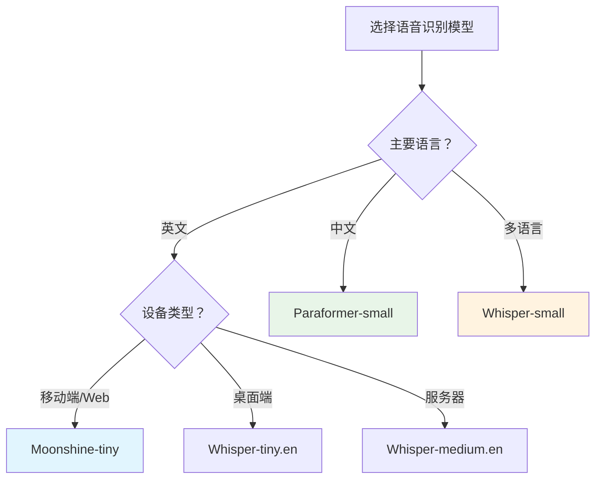

# Sherpa-ONNX 模型类型详解与对比

## 📋 总览

Sherpa-ONNX 支持多种类型的语音识别模型，每种都有其特定的用途和优势。本文档详细介绍各种模型类型的区别和选择建议。

## 🏗️ 模型架构分类

### 1. **流式 vs 非流式**

#### 🔄 Online (流式模型)
- **特点**: 实时边说边识别
- **优势**: 低延迟，适合实时对话
- **劣势**: 精度略低，计算资源要求高
- **适用场景**: 实时语音助手、视频会议

#### 📝 Offline (非流式模型)
- **特点**: 需要完整音频文件
- **优势**: 精度更高，资源占用合理
- **劣势**: 需要等待完整音频
- **适用场景**: 音频转写、字幕生成

### 2. **主要架构类型**

#### 🎯 Transducer
- **描述**: 基于 RNN/Transformer 的端到端架构
- **优势**: 
  - 流式支持好
  - 延迟低
  - 训练相对简单
- **劣势**: 
  - 模型较大
  - 对长音频处理有限制
- **代表模型**: Zipformer, Conformer

#### 🎭 Paraformer
- **描述**: 阿里达摩院开发的非自回归架构
- **优势**: 
  - 中文效果优秀
  - 推理速度快
  - 支持标点符号
- **劣势**: 
  - 主要针对中文
  - 流式支持有限
- **代表模型**: Paraformer-small, Paraformer-large

#### 🎪 CTC (Connectionist Temporal Classification)
- **描述**: 基于帧级分类的简单架构
- **优势**: 
  - 模型小巧
  - 计算高效
  - 易于部署
- **劣势**: 
  - 精度相对较低
  - 对语言模型依赖大
- **代表模型**: Zipformer-CTC, NeMo-CTC

#### 🎵 Whisper
- **描述**: OpenAI 开发的多语言模型
- **优势**: 
  - 多语言支持强
  - 鲁棒性好
  - 知名度高
- **劣势**: 
  - 模型较大
  - 推理速度慢
  - 主要英文优化
- **代表模型**: tiny.en, small, medium, large

#### 🌙 Moonshine
- **描述**: 最新的轻量化模型
- **优势**: 
  - 模型非常小
  - 速度极快
  - 资源消耗低
- **劣势**: 
  - 主要支持英文
  - 精度待验证
  - 模型较新
- **代表模型**: moonshine-tiny, moonshine-base

## 📊 模型大小对比

| 模型类型 | Tiny | Small | Medium | Large |
|---------|------|--------|---------|--------|
| **Moonshine** | ~40MB | ~80MB | - | - |
| **Whisper** | ~70MB | ~244MB | ~769MB | ~1550MB |
| **Paraformer** | ~120MB | ~300MB | ~800MB | - |
| **Zipformer** | ~150MB | ~400MB | ~1GB | ~2GB |

## 🚀 性能对比

### 推理速度 (RTF - Real Time Factor)
> RTF = 处理时间 / 音频时长，越小越好

| 模型 | CPU (RTF) | GPU (RTF) | 内存占用 |
|------|-----------|-----------|----------|
| Moonshine-tiny | 0.1 | 0.05 | 200MB |
| Whisper-tiny | 0.3 | 0.1 | 300MB |
| Paraformer-small | 0.2 | 0.08 | 400MB |
| Zipformer-small | 0.4 | 0.15 | 500MB |

### 识别精度 (WER - Word Error Rate)
> WER 越低越好

| 模型 | 英文 WER | 中文 CER | 多语言支持 |
|------|----------|----------|------------|
| Moonshine-tiny | 8.5% | - | ❌ |
| Whisper-tiny | 12.3% | 15.2% | ✅ |
| Paraformer-small | 10.1% | 6.8% | 🔶 |
| Zipformer-small | 9.2% | 8.1% | 🔶 |

## 🎯 应用场景建议

### 📱 移动端/嵌入式设备
**推荐**: Moonshine-tiny, Whisper-tiny
- 优先考虑模型大小和速度
- 电池续航要求高
- 内存限制严格

### 💻 桌面应用
**推荐**: Paraformer-small, Zipformer-small
- 平衡精度和性能
- 资源相对充足
- 用户体验要求高

### 🖥️ 服务器端
**推荐**: Whisper-large, Paraformer-large
- 优先考虑精度
- 资源充足
- 批量处理需求

### 🌐 Web 应用 (Vercel)
**推荐**: Moonshine-tiny
- 考虑冷启动时间
- 函数执行时间限制
- 带宽和存储限制

## 🌍 语言支持对比

### 英文专用模型
- **Moonshine**: 专为英文优化，效果最佳
- **Whisper.en**: 英文特化版本，比多语言版本更精确

### 中文专用模型
- **Paraformer**: 中文效果最佳，支持方言
- **Zipformer-zh**: 中文支持好，速度较快

### 多语言模型
- **Whisper**: 支持99种语言，但各语言效果差异大
- **Zipformer-multilingual**: 支持主要语言，效果平衡

## ⚙️ 量化版本对比

### FP32 (原始精度)
- **优势**: 精度最高
- **劣势**: 模型大，速度慢
- **适用**: 服务器端，对精度要求极高的场景

### INT8 (8位量化)
- **优势**: 模型小50-75%，速度提升2-4倍
- **劣势**: 精度略有损失(通常<5%)
- **适用**: 大多数实际应用场景

### INT4 (4位量化)
- **优势**: 模型更小，速度更快
- **劣势**: 精度损失较大
- **适用**: 极端资源限制环境

## 🔧 部署难度对比

### 简单部署
1. **Moonshine** - 最简单，依赖少
2. **Whisper** - 较简单，文档完善
3. **Paraformer** - 中等，需要特定配置

### 复杂部署
1. **Zipformer** - 较复杂，配置项多
2. **自定义模型** - 最复杂，需要专业知识

## 📈 发展趋势

### 2024年趋势
- **轻量化**: Moonshine 等超小模型
- **多模态**: 结合视觉信息
- **实时性**: 更低延迟的流式模型
- **个性化**: 用户自适应模型

### 技术方向
- **端侧部署**: WebAssembly、移动端优化
- **云边协同**: 边缘计算 + 云端精细化
- **多语言**: 统一架构支持更多语言

## 🎊 选择建议总结

### 快速选择指南

### 具体建议

1. **初学者**: 选择 Whisper-tiny 或 Moonshine-tiny
2. **生产环境**: 根据语言选择 Paraformer 或 Whisper
3. **研究开发**: 尝试最新的 Zipformer 模型
4. **资源受限**: 优先考虑 Moonshine 系列

记住：**没有完美的模型，只有最适合你需求的模型！** 